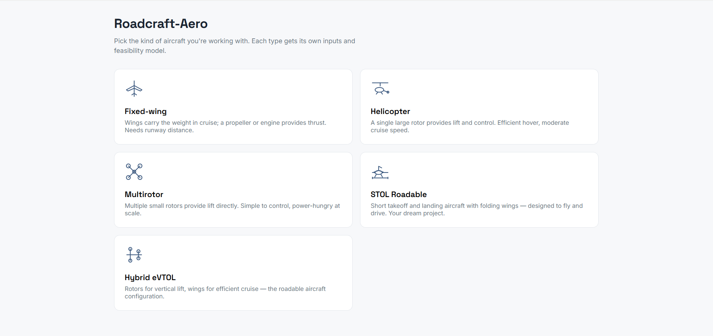

# Aeroframe

A browser-based feasibility explorer for aircraft configurations. Pick a vehicle type, adjust the parameters, and see whether your design holds up against real physics and real reference aircraft.

No installation. No backend. Open the file and it works.

**[Try it live →](https://samriddha-guragain.github.io/aeroframe)**

---

## What it does

You select an aircraft type and configure it using sliders. Aeroframe computes key performance metrics in real time and tells you whether each one is feasible, marginal, or not viable. An overall feasibility score updates as you move the sliders. A radar chart compares your configuration against known production aircraft of the same type.

## Vehicle types

**Fixed-wing** — conventional aircraft where wings provide lift and a propeller or engine provides thrust. Parameters include wingspan, wing area, engine power, battery capacity, and cruise speed. Outputs include wing loading, stall speed, L/D ratio, cruise power required, and range.

**Helicopter** — single large rotor for lift and control. Parameters include rotor diameter, engine power, battery capacity, and cruise speed. Outputs include disk loading, hover power required, hover margin, and range.

**Multirotor** — multiple small rotors providing direct lift. Parameters include rotor count, rotor diameter, motor power, battery capacity, and cruise speed. Outputs include disk loading, hover power, hover margin, and range.

**Hybrid eVTOL** — rotors for vertical takeoff and landing, wings for efficient cruise. Combines hover and fixed-wing physics models. Compared against Joby S4 and Alef Model A.

**STOL Roadable** — short takeoff and landing aircraft with folding wings, designed to operate on both road and runway. This type gets additional outputs: takeoff roll distance, road legality check against the 2.55m EU standard, and a wings folded/extended toggle. Compared against Terrafugia Transition, Zenith STOL CH 750, and PAL-V Liberty.

## How to use

Download `roadcraft-aero.html` and open it in any browser. No dependencies to install.

Select a vehicle type from the home screen. Adjust the sliders. Watch the results update. Switch types anytime using the back button.

## Stack

Single HTML file. Vanilla JavaScript. Chart.js for the radar chart. Google Fonts for typography. No frameworks, no build step, no server.

## Author

Samriddha Guragain
